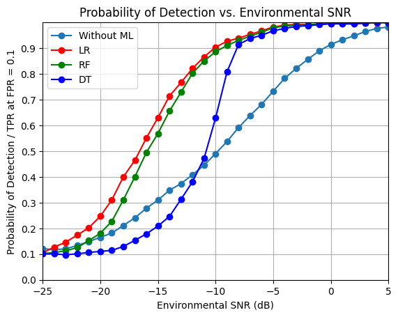
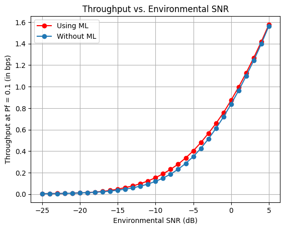

# 🌐 Feature-Based Spectrum Sensing in NOMA for Cognitive IoT Networks with Optimal ML Classifiers

This project dives into Rayleigh fading channels for Non-Orthogonal Multiple Access (NOMA) users. 📡 Leveraging Monte Carlo simulations, it explores signal detection across different Signal-to-Noise Ratios (SNRs). 📊 Plus, we harness the power of Machine Learning to boost signal detection capabilities.

## 📚 Libraries and Dependencies

- **numpy**: For number crunching 🔢.
- **pandas**: Expert at data handling and manipulation 📈.
- **matplotlib**: Our go-to for stunning visualizations and plots 📊.
- **scipy**: A powerhouse for scientific computing, essential for interpolation 🔬.
- **scikit-learn**: The brain behind our Machine Learning models 🤖.

## 🔢 Constants and Parameters

- **Monte Carlo iterations**: `num_iter = 10000`
- **NOMA users**: `N = 2`
- **Power allocations**: `a1, a2 = 0.8, 0.2`
- **Sampled length**: `S = 4096`
- **False-alarm probability**: `Pf = 0.1`
- **Environmental SNR range**: -25dB to 5dB 🔉.
- **Transmitter power**: `transmitter_power = 1`

## 📡 Data Generation & Signal Detection

Utilizing the Monte Carlo simulation, we:

1. Craft NOMA signals with random cyclic delays 🔄.
2. Merge these to form our transmitted signal 📶.
3. Stir in Rayleigh distributed noise for realism 🌪️.
4. Detect NOMA signals with cyclic correlation 🔍.

## 🤖 Machine Learning Insights

We train three ML champions:

- Logistic Regression (LR)
- Random Forest (RF)
- Decision Tree (DT)

They're on a mission to spot NOMA signals. We assess their prowess using the ROC curve, eyeing the True Positive Rate (TPR) against a False Positive Rate (FPR) of 0.1.

## 📊 Visual Mastery

We plot Detection Probability vs. Environmental SNR, showcasing:

- Classic signal detection (sans ML) 🚦
- Logistic Regression (LR) 📈
- Random Forest (RF) 🌳
- Decision Tree (DT) 🌲

## 🚀 Running the Show

1. Clone our repository using `git clone https://github.com/suyashvsingh/NOMA-ML-Spectrum-Detection-CIoT.git` 📂.
2. Install the dependencies using `pip install -r requirements.txt` 📦.
3. Fire up the notebook for an epic plot showdown: traditional vs ML-augmented detection under varied SNRs 📉.

## 📈 The Results

A stunning graph, "Probability of Detection vs. Environmental SNR," awaits you. It pits traditional detection against our ML trio, LR, RF, and DT, focusing on TPR at a steady FPR of 0.1.

  
  

## 🤝 Join the Mission

Jump into:

- Turbocharge the Monte Carlo simulation ⚙️.
- Bring in cutting-edge ML algorithms 🧠.
- Elevate our visualization game 🎨.

---

**Note**: For the whole story and deep insights, explore the notebook 📘.
